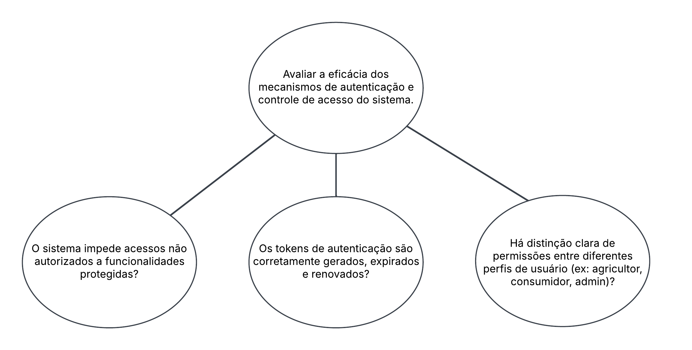
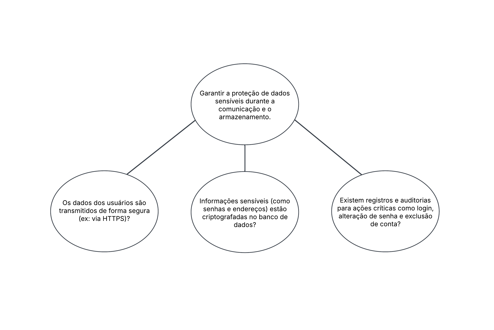

|                |                                       |
| -------------- | ------------------------------------- |
| **Disciplina** | FGA0315 - Qualidade de Software 1     |
| **Turma**      | 2025-1 - T01 - Grace Ropper           |
| **Docente**    | Crisitane Ramos                       |
| **Tema**       | Abordagens de medição e análise (QGM) |

# Goal Question Metrics - Fase Definição

## Objetivo de negócio do AGROMART:

A solução tecnológica denominada Agromart foi desenvolvida para facilitar a relação entre os pequenos agricultores e os consumidores. Ela engloba uma interface web para os agricultores e um aplicativo mobile multi- plataforma para os consumidores, com o propósito de proporcionar ao pequeno agricultor uma maior garantia para o escoamento de sua produção e ajudar pessoas que buscam uma alimentação mais saudável e de qualidade a encontrar seus produtos.

{width=20%}
---

### **Objetivo 1**: Avaliar a eficácia dos mecanismos de autenticação e controle de acesso do sistema.

---

#### 1.1 Perguntas
| ID  | Pergunta                                                                                                 |
| --- | -------------------------------------------------------------------------------------------------------- |
| Q1  | O sistema impede acessos não autorizados a funcionalidades protegidas?                                   |
| Q2  | Os tokens de autenticação são corretamente gerados, expirados e renovados?                               |
| Q3  | Há distinção clara de permissões entre diferentes perfis de usuário (ex: agricultor, consumidor, admin)? |

---
#### 1.2 Diagrama

{width=80%}

---
#### 1.3 Abstraction sheet

<table>
  <tr>
    <td valign="top">
      <strong>Object</strong> 
      Mecanismos de autenticação e controle de acesso do sistema
    </td>
    <td valign="top">
      <strong>Purpose</strong> 
      Avaliar a eficácia dos mecanismos de autenticação e controle de acesso
    </td>
    <td valign="top">
      <strong>Quality Focus</strong> 
      Segurança e controle de acesso: prevenção de acessos não autorizados e gestão correta de tokens
    </td>
    <td valign="top">
      <strong>Viewpoint</strong> 
      Equipe de QA / Segurança
    </td>
  </tr>
</table>

<table>
  <thead>
    <tr>
      <th>Quality Focus</th>
      <th>Variation Factors</th>
      <th>Baseline Hypotheses (estimates)</th>
      <th>Impact of Variation Factors</th>
    </tr>
  </thead>
  <tbody>
    <tr>
      <td valign="top">Incidência de acessos não autorizados bloqueados</td>
      <td valign="top">Perfis de usuário (agricultor, consumidor, admin)</td>
      <td valign="top">O sistema bloqueia 100% dos acessos não autorizados a funcionalidades protegidas</td>
      <td valign="top">Perfis com privilégios maiores demandam regras mais complexas de autorização</td>
    </tr>
    <tr>
      <td valign="top">Taxa de falhas na geração, expiração e renovação de tokens</td>
      <td valign="top">Cenário de sessão: token expirado versus renovação</td>
      <td valign="top">Tokens são gerados e expirados conforme o TTL configurado, renováveis apenas com credenciais válidas</td>
      <td valign="top">Ambientes de rede instáveis podem causar renovações de token falhas</td>
    </tr>
    <tr>
      <td valign="top">Erros de permissão entre perfis de usuário</td>
      <td valign="top">Níveis de privilégio e sobreposição de papéis</td>
      <td valign="top">Perfis de usuário têm permissões estritamente segregadas sem sobreposição indevida</td>
      <td valign="top">Aumentar o número de perfis amplia o conjunto de cenários de teste</td>
    </tr>
    <tr>
      <td valign="top"></td>
      <td valign="top">Condições de rede (latência, instabilidade)</td>
      <td valign="top"></td>
      <td valign="top"></td>
    </tr>
  </tbody>
</table>

---

### **Objetivo 2:** Garantir a proteção de dados sensíveis durante a comunicação e o armazenamento.

---

#### 2.1 Perguntas

| ID  | Pergunta                                                                                               |
| --- | ------------------------------------------------------------------------------------------------------ |
| Q4  | Os dados dos usuários são transmitidos de forma segura (ex: via HTTPS)?                                |
| Q5  | Informações sensíveis (como senhas e endereços) estão criptografadas no banco de dados?                |
| Q6  | Existem registros e auditorias para ações críticas como login, alteração de senha e exclusão de conta? |

---

#### 2.2 Diagrama

{width=80%}
---

#### 2.3 Abstraction sheet

<table>
  <tr>
    <td valign="top"><strong>Object</strong> 
      Proteção de dados sensíveis durante comunicação e armazenamento
    </td>
    <td valign="top"><strong>Purpose</strong> 
      Garantir a proteção de dados sensíveis em trânsito e em repouso
    </td>
    <td valign="top"><strong>Quality Focus</strong> 
      – Segurança de transmissão (HTTPS) 
      – Criptografia em repouso (banco de dados) 
      – Auditoria de operações críticas
    </td>
    <td valign="top"><strong>Viewpoint</strong> 
      Equipe de QA / Segurança
    </td>
  </tr>
</table>

<table>
  <thead>
    <tr>
      <th>Quality Focus</th>
      <th>Variation Factors</th>
      <th>Baseline Hypotheses (estimates)</th>
      <th>Impact of Variation Factors</th>
    </tr>
  </thead>
  <tbody>
    <tr>
      <td valign="top">Percentual de requisições via HTTPS bem-sucedidas sem downgrade</td>
      <td valign="top">Tipo de dado sensível (senha, endereço, documento de identidade)</td>
      <td valign="top">100% das requisições são feitas via HTTPS com certificados válidos</td>
      <td valign="top">Ambientes com alto volume de requisições podem apresentar quedas na taxa de HTTPS se a infra-estrutura TLS não escalar adequadamente</td>
    </tr>
    <tr>
      <td valign="top">Porcentagem de campos sensíveis (senhas, endereços) criptografados em repouso</td>
      <td valign="top">Mecanismo de criptografia (AES-256, RSA, hashing)</td>
      <td valign="top">100% dos campos sensíveis estão criptografados no banco usando algoritmo forte (ex: AES-256)</td>
      <td valign="top">Diferentes tipos de dados podem exigir políticas de criptografia ou tokenização distintas, afetando desempenho e complexidade</td>
    </tr>
    <tr>
      <td valign="top">Cobertura de registros de auditoria para login, alteração de senha e exclusão de conta</td>
      <td valign="top">Versão de protocolo TLS e configuração de cipher suites</td>
      <td valign="top">100% das ações críticas (login, alteração de senha, exclusão de conta) geram entradas de auditoria completas e legíveis</td>
      <td valign="top">Atualizações de bibliotecas de criptografia ou TLS podem introduzir incompatibilidades temporárias</td>
    </tr>
  </tbody>
</table>

## Histórico de Versão

| Date       | Version | Changes                                        | Author                                              | Matrícula | % de Contribuição |
| ---------- | ------- | ---------------------------------------------- | --------------------------------------------------- | --------- | ----------------- |
| 13/05/2025 | 0.1     | Create initial documentation                   | [Lucas Antunes](https://github.com/LucasGSAntunes)  | 190091681 | --%               |
| 14/05/2025 | 0.2     | Create, format and review documentation        | [Lucas Antunes](https://github.com/LucasGSAntunes)  | 190091681 | 16%               |
|            |         | Definição do Objetivo do Agromart - Introdução | [Túlio Celeri](https://github.com/TulioCeleri)      | 222026715 | 16%               |
|            |         | Diagramação - 1.2, 2.2                         | [João Paulo](https://github.com/joaombc)            | 202045141 | 16%               |
|            |         | Ajuste das perguntas e objetivos - 1.1, 2.1    | [Pedro Ferreira Gondim](https://github.com/G0ndim)  | 222026377 | 16%               |
|            |         | Abstraction Sheet - 1.3                        | [João Pedro](https://github.com/JoaoPedrooSS)       | 222006258 | 16%               |
|            |         | Abstraction Sheet - 2.3                        | [Pedro Ferreira Gondim](https://github.com/guinuto) | 200038028 | 16%               |

